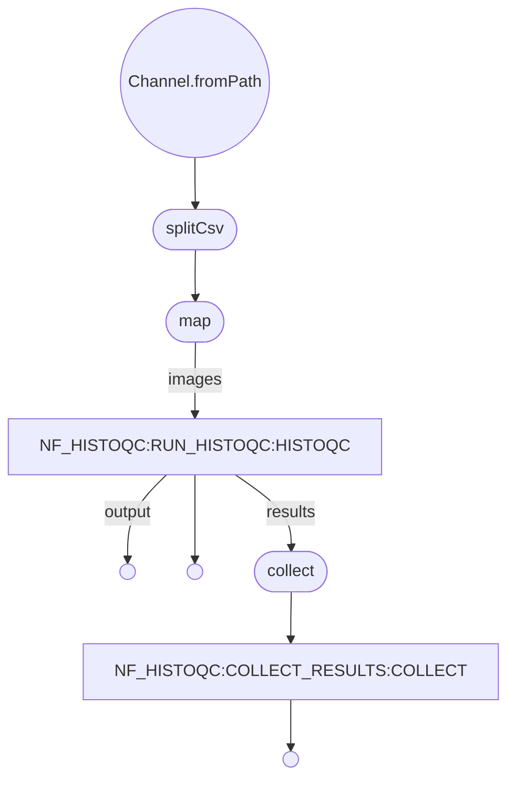

# 🍏🔬✅ `nf-histoqc`

A [NextFlow](https://nextflow.io) wrapper for the digital pathology quality control tool [HistoQC](https://github.com/choosehappy/HistoQC).

[](https://www.nextflow.io/) 
[](https://tower.nf/launch?pipeline=https://github.com/mc2-center/nf-histoqc) 


[](https://www.docker.com/) 


Developed for the [Multi-Consortia Coordinating (MC2) Center](https://sagebionetworks.org/research-projects/mc2-center/) administrative supplement "Assuring AI/ML-readiness of digital pathology in diverse existing and emerging multi-omic datasets through quality control workflows" ([3U24CA274494-02S2](https://reporter.nih.gov/search/ONzQ0UoaEUyMrZ2_l6U_yw/project-details/10841333)).

> The project will improve the AI/ML readiness of existing and emerging NIH-supported digital pathology public datasets, and research programs supported by the MC2 Center, by automatically evaluating and reporting artifacts and batch effects using open-source NIH-funded tools. These enriched datasets will enable researchers to exclude artifacts from their training and validation sets in a reproducible manner, providing greater trust in cross-investigator dataset reuse while enhancing AI/ML model performance and robustness. To quantitatively demonstrate the provided value-add of cleaned AI/ML-ready data in downstream tasks, a prototypical deep learning use case is planned.

### Example usage

```
nextflow run mc2-center/nf-histoqc \
  --input <path-to-samplesheet> \
  --outdir <path-to-output-directory> \
  --profile local
```

### Test usage

To test on `CMU-1-Small-Region.svs` (included in repo) and output to `./outputs`

```
nextflow run mc2-center/nf-histoqc -profile test
```

### Samplesheet

`nf-histoqc` takes a CSV samplesheet containing the following columns
- `image`: [string] Path or URI to image to be processed

Other columns may be provided but are not used by the pipeline.
### Output

`nf-histoqc` outputs the following directory structure into the specified output directory (`outDir`):

```
├── <outDir>
│   ├── results.tsv
│   ├── <baseName for first row of samplesheet>
│   │   ├── *.png <masks and images generated by HistoQC>
│   │   ├── ...
│   ├── <baseName for n'th row of samplesheet>
```

### Options

#### Input/Output options

- `input`: Path to a CSV sample sheet. This parameter is required.
- `outDir`: Specifies the directory where the output data should be saved. Default is `outputs`.

#### HistoQC options

- `config`: Configuration file used by HistoQC.  Must be one of `default`, `ihc`, `clinical`, `first`, `light`, or `v2.1`.Custom config files are not currently supported.

### Profiles

- `test`: Runs test samplesheet in `test_data/test_samplesheet.csv`
- `sage`: Optimized configuration for Sage's Nextflow Tower instance.
- `local`: Low resources suitable for runs on laptops etc.
- `tower`: Minimal configuration for Nextflow Tower. 

### Docker container

A docker container is provided for reproducibility and hosted on [ghcr.io](ghcr.io). The image is rebuilt in GitHub actions whenver the Dockerfile or build and deploy actions are modified.

The Dockerfile is based on that provided in the HistoQC repo, with the addition of `procps` and modification of some container settings to allow us in Nextflow Tower.

The container is automatically pulled by NextFlow, but if local use is required you can use:
`docker pull ghcr.io/mc2-center/nf-histoqc:latest`

### DAG

>A Nextflow pipeline is implicitly modelled by a direct acyclic graph (DAG). The vertices in the graph represent the pipeline’s processes and operators, while the edges represent the data connections (i.e. channels) between them.


